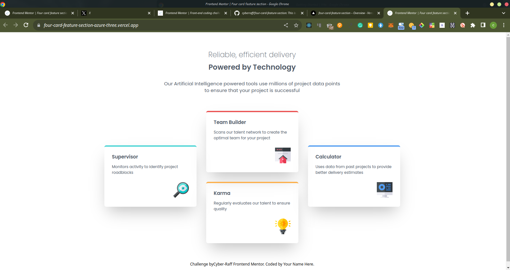

# Frontend Mentor - Four card feature section solution

This is a solution to the [Four card feature section challenge on Frontend Mentor](https://www.frontendmentor.io/challenges/four-card-feature-section-weK1eFYK). Frontend Mentor challenges help you improve your coding skills by building realistic projects. 

## Table of contents

- [Frontend Mentor - Four card feature section solution](#frontend-mentor---four-card-feature-section-solution)
  - [Table of contents](#table-of-contents)
    - [The challenge](#the-challenge)
    - [Screenshot](#screenshot)
    - [Links](#links)
    - [Built with](#built-with)
  - [Author](#author)
### The challenge

Users should be able to:

- View the optimal layout for the site depending on their device's screen size

### Screenshot

### Links

- Solution URL: [GitHub](https://github.com/cyberraff/four-card-feature-section)
- Live Site URL: [Four Card Feature Section](https://four-card-feature-section-azure-three.vercel.app/)

### Built with

- Mobile-first workflow
- [React](https://reactjs.org/) - JS library
- [Tailwind](https://tailwindcss.com/) - A utility-first CSS framework

## Author

- Website - [Coming Soon](https://www.your-site.com)
- Frontend Mentor - [@cyberraff](https://www.frontendmentor.io/profile/yourusername)
- Twitter - [@CyberRaff_](https://www.twitter.com/yourusername)
